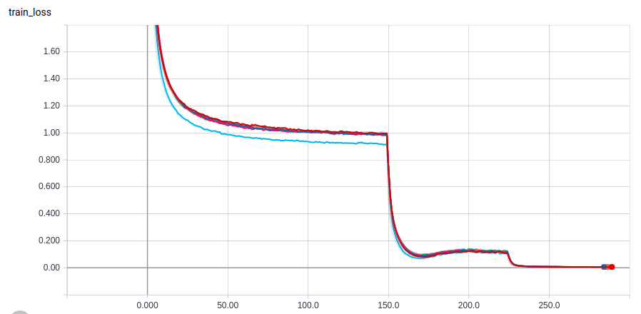

# A PyTorch Implementation of PyramidNet

This is a [PyTorch](http://pytorch.org/) implementation of the
Pyramid type architecture as described in the
paper [Deep Pyramidal Residual Networks](https://arxiv.org/abs/1610.02915)
by Dongyoon Han*, Jiwhan Kim*, and Junmo Kim.
Their official implementation and links to many other
third-party implementations are available in the
[jhkim89/PyramidNet](https://github.com/jhkim89/PyramidNet)
repo on GitHub.The code in this repository is based on the example provided in [PyTorch examples](https://github.com/pytorch/examples/tree/master/imagenet)

# Mixture of Softmaxes
This implementation incorporates MoS layer which is introduced in [Breaking the Softmax Bottleneck: A High-Rank Language Model](https://arxiv.org/abs/1711.03953) to deal with bottleneck in softmax. Recurrent dropout is also added to stabilise training. Information about why i used MoS layer can be found in pyramidnet IPython notebook.

## Usage examples
To train additive PyramidNet-110 (alpha=48 with out MoS layer) on CIFAR-10 dataset with GPU:
```
CUDA_VISIBLE_DEVICES=0 python train.py --alpha 48 --depth 110  --batchsize 128 --lr 0.01 --print-freq 1 --expname PyramidNet-110 --dataset cifar10 --cuda
```
To train additive PyramidNet-110 (alpha=48 with MoS layer with 6 number of experts and 0.3 recurrent dropout) on CIFAR-100 dataset with :
```
CUDA_VISIBLE_DEVICES=0,1,2,3 python train.py --alpha 48 --depth 110 --batchsize 128 --lr 0.5 --print-freq 1 --expname PyramidNet-110 --dataset cifar100 --cuda --mos --k 6 --rd 0.3 
```
## Tracking training progress with TensorBoard
Thanks to the [implementation](https://github.com/andreasveit/densenet-pytorch), which support the [TensorBoard](https://www.tensorflow.org/get_started/summaries_and_tensorboard) to track training progress efficiently, all the experiments can be tracked with [tensorboard_logger](https://github.com/TeamHG-Memex/tensorboard_logger).

Tensorboard_logger can be installed with 
```
pip install tensorboard_logger
```
## Results 
Pre-trained weights and training log file of model with different number of experts can be found [here](https://drive.google.com/open?id=101dn9Hi0Zp6OD8_obtVOYWrUl5qFXqYX).  




## Requirements 
Pytorch 0.3 <br>
Python 3.5 <br>
Numpy <br>
Tensorboard Logger


